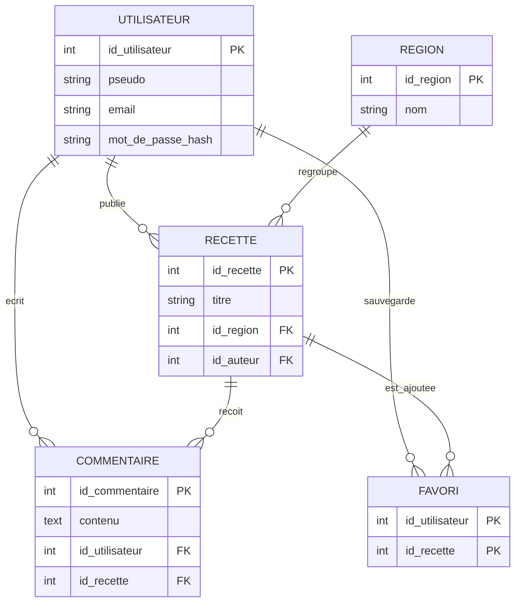

```mermaid
erDiagram
  UTILISATEUR ||--o{ RECETTE : publie
  UTILISATEUR ||--o{ COMMENTAIRE : ecrit
  UTILISATEUR ||--o{ FAVORI : sauvegarde
  REGION ||--o{ RECETTE : regroupe
  RECETTE ||--o{ COMMENTAIRE : recoit
  RECETTE ||--o{ FAVORI : est_ajoutee
  UTILISATEUR {
    int id_utilisateur PK
    string pseudo
    string email
    string mot_de_passe_hash
  }
  REGION {
    int id_region PK
    string nom
  }
  RECETTE {
    int id_recette PK
    string titre
    int id_region FK
    int id_auteur FK
  }
  COMMENTAIRE {
    int id_commentaire PK
    text contenu
    int id_utilisateur FK
    int id_recette FK
  }
  FAVORI {
    int id_utilisateur PK
    int id_recette PK
  }
```