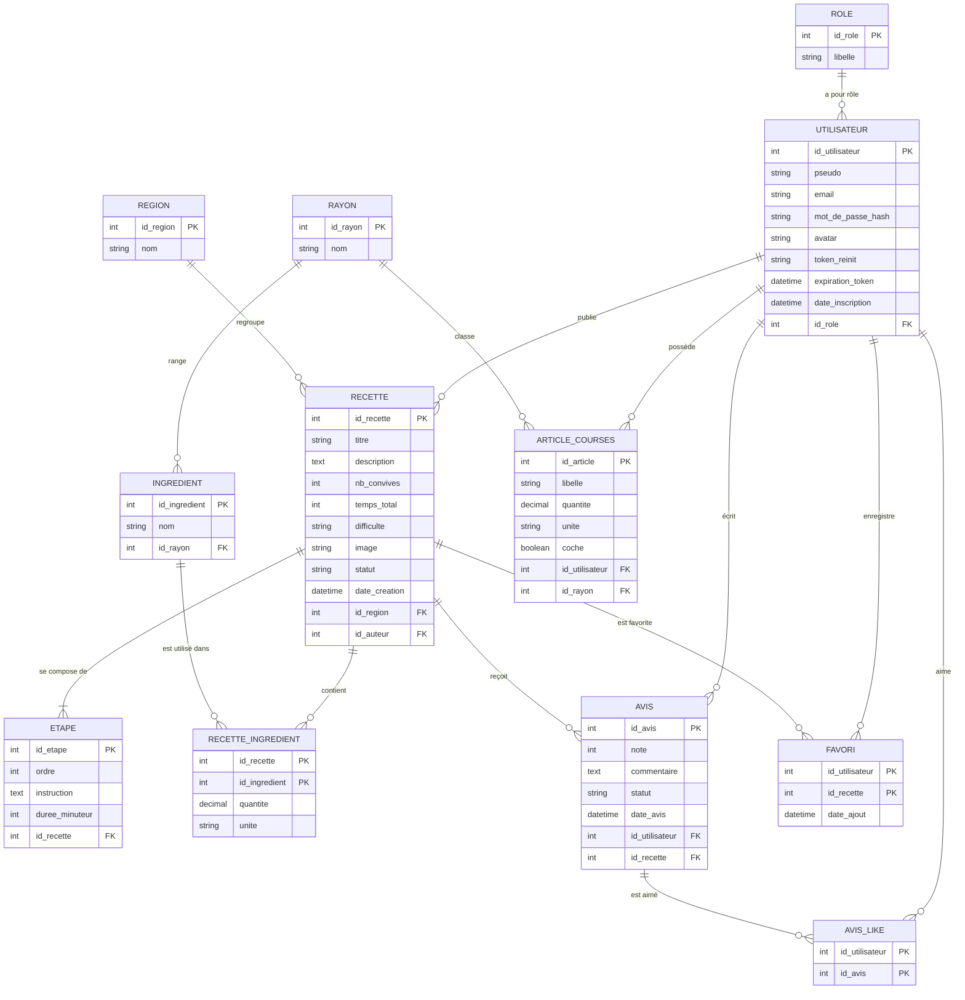

# Schéma de la base de données (modèle logique)

```mermaid
erDiagram
  ROLE ||--o{ UTILISATEUR : "a pour rôle"
  UTILISATEUR ||--o{ RECETTE : "publie"
  REGION ||--o{ RECETTE : "regroupe"
  RECETTE ||--|{ ETAPE : "se compose de"
  RECETTE ||--o{ RECETTE_INGREDIENT : "contient"
  INGREDIENT ||--o{ RECETTE_INGREDIENT : "est utilisé dans"
  RAYON ||--o{ INGREDIENT : "range"
  UTILISATEUR ||--o{ AVIS : "écrit"
  RECETTE ||--o{ AVIS : "reçoit"
  UTILISATEUR ||--o{ FAVORI : "enregistre"
  RECETTE ||--o{ FAVORI : "est favorite"
  UTILISATEUR ||--o{ AVIS_LIKE : "aime"
  AVIS ||--o{ AVIS_LIKE : "est aimé"
  UTILISATEUR ||--o{ ARTICLE_COURSES : "possède"
  RAYON ||--o{ ARTICLE_COURSES : "classe"

  ROLE {
    int id_role PK
    string libelle
  }
  UTILISATEUR {
    int id_utilisateur PK
    string pseudo
    string email
    string mot_de_passe_hash
    string avatar
    string token_reinit
    datetime expiration_token
    datetime date_inscription
    int id_role FK
  }
  REGION {
    int id_region PK
    string nom
  }
  RECETTE {
    int id_recette PK
    string titre
    text description
    int nb_convives
    int temps_total
    string difficulte
    string image
    string statut
    datetime date_creation
    int id_region FK
    int id_auteur FK
  }
  ETAPE {
    int id_etape PK
    int ordre
    text instruction
    int duree_minuteur
    int id_recette FK
  }
  RAYON {
    int id_rayon PK
    string nom
  }
  INGREDIENT {
    int id_ingredient PK
    string nom
    int id_rayon FK
  }
  RECETTE_INGREDIENT {
    int id_recette PK
    int id_ingredient PK
    decimal quantite
    string unite
  }
  AVIS {
    int id_avis PK
    int note
    text commentaire
    string statut
    datetime date_avis
    int id_utilisateur FK
    int id_recette FK
  }
  AVIS_LIKE {
    int id_utilisateur PK
    int id_avis PK
  }
  FAVORI {
    int id_utilisateur PK
    int id_recette PK
    datetime date_ajout
  }
  ARTICLE_COURSES {
    int id_article PK
    string libelle
    decimal quantite
    string unite
    boolean coche
    int id_utilisateur FK
    int id_rayon FK
  }
```
